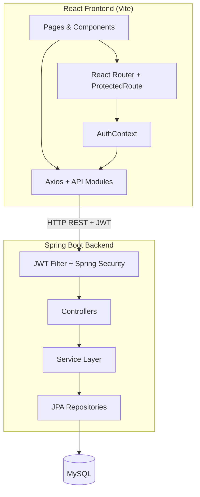
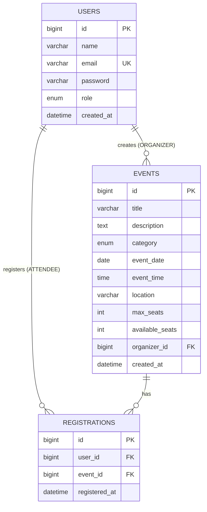

# EventSphere — Event Management System

A full-stack event management platform where **Organizers** create and manage events, and **Attendees** browse, search, and register for events. Built with Spring Boot, JWT security, and a React single-page application.

> **Live demo (local):** Frontend `http://localhost:5173` · Backend `http://localhost:8090/api/v1` · Swagger `http://localhost:8090/api/v1/swagger-ui.html`

---

## Project Overview

EventSphere solves a common campus and community problem: coordinating events across two user types with different permissions.

| Role | Capabilities |
|------|----------------|
| **Organizer** | Create, update, delete own events; view organizer dashboard |
| **Attendee** | Browse public events; register/cancel registrations; view personal registrations |
| **Guest** | Browse events and event details; sign up or log in |

The backend exposes a REST API with role-based access control (RBAC), standardized JSON responses, and JWT authentication. The frontend consumes these APIs with protected routes, role-aware navigation, and a responsive UI.

---

## Features

### Authentication & Authorization
- User registration with role selection (`ORGANIZER` / `ATTENDEE`)
- JWT-based login with BCrypt password hashing
- Role-based API protection via Spring Security
- Protected frontend routes (guest-only, authenticated, role-specific)

### Event Management (Organizer)
- Create events with title, description, category, date, time, location, and seat capacity
- Update and delete **own** events only
- Organizer dashboard (`My Events`)

### Event Discovery (Public)
- Paginated event listing
- Search by title
- Filter by category (`TECH`, `WORKSHOP`, `SEMINAR`, `HACKATHON`, `CULTURAL`, `SPORTS`, `OTHER`)
- Event detail page

### Registration (Attendee)
- Register for available events
- Cancel registration
- View all registered events
- Business rules: no duplicate registration, block when full, block after event date

### Developer Experience
- Standardized API wrapper: `{ success, message, data }`
- Global exception handling with meaningful HTTP status codes
- Swagger / OpenAPI documentation
- CORS configured for React dev server

---

## Tech Stack

### Backend
| Technology | Purpose |
|------------|---------|
| Java 17 | Language |
| Spring Boot 3.3.5 | Application framework |
| Spring Data JPA / Hibernate | ORM & persistence |
| Spring Security | Authentication & authorization |
| MySQL | Relational database |
| JWT (jjwt 0.12.6) | Stateless token auth |
| Lombok | Boilerplate reduction |
| springdoc-openapi | API documentation |
| Maven | Build & dependency management |

### Frontend
| Technology | Purpose |
|------------|---------|
| React 19 | UI library |
| Vite 8 | Build tool & dev server |
| React Router 7 | Client-side routing |
| Axios | HTTP client with JWT interceptor |
| Tailwind CSS 4 | Styling |
| Framer Motion | Animations |
| Lucide React | Icons |

---

## Folder Structure

```
Event_Management_system/
├── src/main/java/com/jyoti/eventmanagement/
│   ├── config/              # Security, CORS, OpenAPI, app beans
│   ├── controller/          # REST controllers (Auth, Event, Registration)
│   ├── dto/
│   │   ├── request/         # LoginRequest, RegisterRequest, EventRequest
│   │   └── response/        # ApiResponse, AuthResponse, EventResponse, etc.
│   ├── entity/              # JPA entities (User, Event, Registration)
│   │   └── enums/           # Role, EventCategory
│   ├── exception/           # Custom exceptions + GlobalExceptionHandler
│   ├── repository/          # Spring Data JPA repositories
│   ├── security/            # JWT filter, JwtService, entry points
│   ├── service/             # Business logic layer
│   └── util/                # ApiResponseUtil
├── src/main/resources/
│   ├── application.properties
│   ├── application-example.properties
├── frontend/
│   ├── src/
│   │   ├── api/             # axios.js, authApi, eventApi, registrationApi
│   │   ├── components/
│   │   │   ├── auth/        # LoginForm, RegisterForm
│   │   │   ├── common/      # Navbar, ProtectedRoute, LoadingSpinner, ErrorAlert
│   │   │   └── events/      # EventCard, EventList, EventFilters, EventForm
│   │   ├── context/         # AuthContext (JWT session)
│   │   ├── layouts/         # MainLayout, AuthLayout
│   │   ├── pages/           # Home, Login, Register, EventDetail
│   │   │   ├── organizer/   # MyEvents, CreateEvent, EditEvent
│   │   │   └── attendee/    # MyRegistrations
│   │   ├── routes/          # AppRoutes (route protection)
│   │   └── utils/           # constants, helpers
│   ├── .env.example
│   └── package.json
├── pom.xml
└── README.md
```

---

## Installation Guide

### Prerequisites
- **JDK 17+**
- **Maven 3.8+**
- **Node.js 18+** and npm
- **MySQL 8+** running locally

### 1. Clone the repository
```bash
git clone https://github.com/<your-username>/event-management-system.git
cd event-management-system
```

### 2. Backend setup

**Configure secrets** — copy the example file and set your local values:

```bash
cp src/main/resources/application-example.properties src/main/resources/application-local.properties
```

Edit `application-local.properties` (gitignored) with your MySQL password and JWT secret:

```properties
spring.datasource.password=YOUR_MYSQL_PASSWORD
jwt.secret=YOUR_SECURE_JWT_SECRET_AT_LEAST_32_CHARS
```

Alternatively, set environment variables:

| Variable | Maps to |
|----------|---------|
| `SPRING_DATASOURCE_PASSWORD` | MySQL password |
| `JWT_SECRET` | JWT signing key (min 32 chars) |
| `DB_USERNAME` | MySQL username (optional, default: `root`) |
| `DB_URL` | JDBC URL (optional) |

**Run the backend:**
```bash
mvn spring-boot:run
```

The API starts at **`http://localhost:8090/api/v1`**.

Verify: open Swagger UI at `http://localhost:8090/api/v1/swagger-ui.html`

### 3. Frontend setup

```bash
cd frontend
cp .env.example .env
npm install
npm run dev
```

The app opens at **`http://localhost:5173`**.

### 4. Quick test flow
1. Register as **Organizer** → create an event
2. Log out → register as **Attendee** (different email)
3. Browse home → open event → **Register Now**
4. Check **My Registrations** in the navbar

---

## Environment Variables

### Frontend (`frontend/.env`)

| Variable | Description | Example |
|----------|-------------|---------|
| `VITE_API_BASE_URL` | Backend API base URL (includes context path) | `http://localhost:8090/api/v1` |

> Copy `frontend/.env.example` to `frontend/.env` before running the frontend. Never commit `.env` files with secrets.

### Backend (secrets — never commit)

| Variable / Property | Description |
|---------------------|-------------|
| `spring.datasource.password` | MySQL password — set in `application-local.properties` or `SPRING_DATASOURCE_PASSWORD` |
| `jwt.secret` | JWT signing key (min 32 characters) — set in `application-local.properties` or `JWT_SECRET` |
| `DB_USERNAME` | MySQL username (optional, default: `root`) |
| `DB_URL` | JDBC connection URL (optional) |

### Backend (committed defaults in `application.properties`)

| Property | Description |
|----------|-------------|
| `server.port` | Server port (default: `8090`) |
| `server.servlet.context-path` | API prefix (default: `/api/v1`) |
| `jwt.expiration` | Token TTL in ms (default: 86400000 = 24h) |
| `app.cors.allowed-origins` | Allowed frontend origin(s) |

> See `application-example.properties` for the full local configuration template.

---

## API Endpoints

**Base URL:** `http://localhost:8090/api/v1`

### Standard Response Format

```json
{
  "success": true,
  "message": "Operation description",
  "data": { }
}
```

Validation errors return field-level details in `data`:
```json
{
  "success": false,
  "message": "Validation failed",
  "data": { "email": "Email must be valid" }
}
```

---

### Authentication (`/auth`) — Public

| Method | Endpoint | Description |
|--------|----------|-------------|
| `POST` | `/auth/register` | Register a new user |
| `POST` | `/auth/login` | Login and receive JWT |

**Register body:**
```json
{
  "name": "Jane Doe",
  "email": "jane@example.com",
  "password": "password123",
  "role": "ATTENDEE"
}
```

**Login body:**
```json
{
  "email": "jane@example.com",
  "password": "password123"
}
```

**Auth response `data`:**
```json
{
  "token": "<JWT>",
  "email": "jane@example.com",
  "name": "Jane Doe",
  "role": "ATTENDEE"
}
```

---

### Events (`/events`)

| Method | Endpoint | Auth | Role | Description |
|--------|----------|------|------|-------------|
| `GET` | `/events` | No | — | List events (search, filter, paginate) |
| `GET` | `/events/{id}` | No | — | Get event by ID |
| `GET` | `/events/my-events` | Yes | ORGANIZER | List organizer's events |
| `POST` | `/events` | Yes | ORGANIZER | Create event |
| `PUT` | `/events/{id}` | Yes | ORGANIZER | Update own event |
| `DELETE` | `/events/{id}` | Yes | ORGANIZER | Delete own event |

**Query params for `GET /events`:**
- `title` — search by title (optional)
- `category` — `TECH`, `WORKSHOP`, etc. (optional)
- `page`, `size`, `sort` — pagination (default size: 10)

**Create / update event body:**
```json
{
  "title": "Tech Meetup",
  "description": "Monthly developer meetup",
  "category": "TECH",
  "date": "2026-08-15",
  "time": "18:30:00",
  "location": "Auditorium A",
  "maxSeats": 100
}
```

---

### Registrations (`/registrations`) — Authenticated

| Method | Endpoint | Role | Description |
|--------|----------|------|-------------|
| `POST` | `/registrations/{eventId}` | ATTENDEE | Register for event |
| `DELETE` | `/registrations/{eventId}` | ATTENDEE | Cancel registration |
| `GET` | `/registrations/my-events` | ATTENDEE | List my registrations |

> Send JWT in header: `Authorization: Bearer <token>`

---

## Architecture Diagram



### Request Flow (Authenticated API Call)
1. User logs in → JWT stored in `localStorage`
2. Axios interceptor attaches `Authorization: Bearer <token>`
3. `JwtAuthenticationFilter` validates token and sets security context
4. `@PreAuthorize` checks role before controller method runs
5. Service layer applies business rules → repository persists data
6. `ApiResponse<T>` returned to frontend

---

## Database ER Diagram



**Constraints:**
- `registrations(user_id, event_id)` — unique (no duplicate registration)
- `available_seats` decremented on registration, incremented on cancel
- Organizer can only modify/delete their own events

---

## Frontend Routes

| Route | Access | Page |
|-------|--------|------|
| `/` | Public | Home (browse events) |
| `/events/:id` | Public | Event details |
| `/login` | Guest only | Login |
| `/register` | Guest only | Register |
| `/organizer/my-events` | Organizer | My Events dashboard |
| `/organizer/create` | Organizer | Create event |
| `/organizer/edit/:id` | Organizer | Edit event |
| `/attendee/my-registrations` | Attendee | My Registrations |

---

## Future Improvements

- [ ] Email notifications (registration confirmation, event reminders)
- [ ] Organizer analytics dashboard (registrations per event, seat utilization)
- [ ] Event image upload (S3 / Cloudinary)
- [ ] Admin role for platform-wide moderation
- [ ] Refresh tokens and token rotation
- [ ] Unit & integration tests (JUnit, MockMvc, React Testing Library)
- [ ] Docker Compose for one-command setup
- [ ] CI/CD pipeline (GitHub Actions)
- [ ] Deploy backend (Railway / Render) + frontend (Vercel / Netlify)
- [ ] Password reset via email OTP
- [ ] Waitlist when events are full

---

## Recommended Screenshots for GitHub

Include these in a `docs/screenshots/` folder and link them in the README:

| # | Screenshot | Why it matters |
|---|------------|----------------|
| 1 | **Home page** with event grid, search, and filters | Shows public browsing UX |
| 2 | **Event detail page** with register button | Demonstrates attendee flow |
| 3 | **Organizer — My Events** dashboard | Shows CRUD management |
| 4 | **Create / Edit Event** form | Highlights organizer capabilities |
| 5 | **Attendee — My Registrations** | Shows registration management |
| 6 | **Login / Register** pages | Auth UX |
| 7 | **Navbar — role comparison** (3 crops: guest, organizer, attendee) | Proves RBAC in UI |
| 8 | **Swagger UI** | Shows API documentation |
| 9 | **Mobile responsive view** | Responsive design proof |

**Tip:** Use the same sample data across screenshots so the repo looks polished and consistent.

---

## Resume Bullet Points

Use these as starting points — customize with your metrics:

- Built a **full-stack Event Management System** using **Spring Boot, MySQL, JWT, and React**, supporting role-based access for Organizers and Attendees.
- Implemented **RESTful APIs** with standardized responses, pagination, search/filter, and **Swagger documentation**.
- Designed **JWT authentication** with BCrypt hashing, Spring Security filters, and `@PreAuthorize` role guards.
- Developed a **React SPA** with protected routes, AuthContext session management, Axios interceptors, and role-aware navigation.
- Enforced business rules including **seat capacity**, duplicate registration prevention, event ownership checks, and registration cutoff by date.
- Applied **layered architecture** (Controller → Service → Repository) with global exception handling and custom domain exceptions.

---

## Interview Questions (Based on This Project)

### Spring Boot & Backend
1. Explain the layered architecture used in this project. Why separate Controller, Service, and Repository?
2. How does `@PreAuthorize("hasRole('ORGANIZER')")` work under the hood?
3. What is the purpose of `GlobalExceptionHandler`? How does it improve API consistency?
4. Why use DTOs instead of returning JPA entities directly?
5. What happens when `available_seats` reaches 0? Walk through the registration flow.

### Security & JWT
6. Explain the JWT authentication flow from login to protected API access.
7. Where is the JWT validated — filter or controller? What is `JwtAuthenticationFilter` doing?
8. Why store passwords with BCrypt instead of plain hash (SHA-256)?
9. What is the difference between 401 and 403 in this project?
10. How would you implement refresh tokens in this architecture?

### Database & JPA
11. Explain the relationship between `User`, `Event`, and `Registration`.
12. Why is there a unique constraint on `(user_id, event_id)` in registrations?
13. What is `open-in-view=false` and why is it set in this project?
14. How would you write a query to find all events with available seats > 0?

### React & Frontend
15. How does `ProtectedRoute` enforce guest-only vs role-specific routes?
16. Explain how the Axios interceptor handles 401 responses.
17. Why is auth state stored in both React Context and `localStorage`?
18. How does the Home page handle search, category filter, and pagination together?

### System Design
19. How would you scale this system for 10,000 concurrent users registering for one event?
20. What caching strategy would you add for the public event listing endpoint?
21. How would you deploy this project to production?

---

## Author

**Jyoti Rai**

---

## License

This project is built for learning and placement portfolio purposes.
